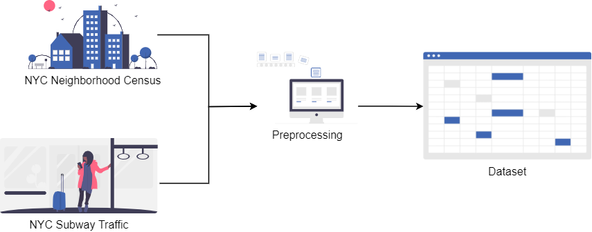

# FairWell

## Try it out

https://fairwell-app.herokuapp.com/

## How to Run Locally

1. Clone this repository
2. Run `pip install -r requirements.txt` to install the required dependencies
3. Run `streamlit run app.py` and copy the URL to your web browser

***

## Introduction

FairWell is a Responsible AI tool developed using Streamlit. The aim is to address model biasness on specific groups of people, allowing data scientists to evaluate their dataset and model predictions, and take steps toward making their datasets more inclusive and their models less biased. The tool allows users to detect fairness issues in both datasets and models, and in turn, get inspiration on various mitigation approaches through mitigation recommendations.

In this report, research on Responsible AI is presented, followed by elaborating on the FairWell tool. Lastly, a use case on how Responsible AI can be used to evaluate a model is shown, where the New York City (NYC) Subway dataset is used to model a binary classification problem on high/low traffic.

## Responsible AI Research

The problem of defining and addressing fairness has been a topic of increasing importance in the recent years. Especially with work surrounding machine learning. Multiple definitions of fairness have been raised, each having their own pros and cons. This work does not aim to propose a single notion of fairness but rather we aim to (i) provide tools on how to measure and assess fairness and (ii) how to mitigate bias in models where necessary. Our work can be summarised as below:

1. Fairness assessment1, 12, 13
   1. On data
   2. On model predictions
2. Bias mitigation12
   1. Pre-processing by transforming the data 
   2. In-processing by imposing constraints during training
   3. Post-processing where the predictions of models are modified

### Fairness Assessment
The first step to mitigating bias is measuring. In this work, we look at identifying the presence of bias in 2 locations: (i) bias in the data and (ii) bias in the predictions.

#### Fairness Assessment (Data)

The quality of data used will heavily influence the performance and fairness of the model. Therefore, identifying bias in the training data is an important step in weeding out potential biases. However, this assumes that historical bias and discrimination are not the root cause of bias in the data. Nonetheless, several model-independent metrics can be used to inform the user about the presence of bias and efforts can be made to reduce skewed data distributions. Examples include but not limited to class imbalance, Jensen-Shannon divergence, etc. 1

#### Fairness Assessment (Predictions)

More commonly, we identify bias based on decisions (i.e. predicitions) made by the model after training (and bias mitigation). Generally, fairness decision definitions can be categorised into 4 areas, (i) individual, (ii) group, (iii) per group performance and (iv) causality based criteria.13

- **Individual Fairness.** Fairness definitions at the individual level focuses on the relative similarity between individuals. Therefore, similar individuals should be treated similarly with similar decisions.12, 13

- **Group Fairness.** Group fairness as the term suggests, focuses on reducing bias for a group of individuals. It is believed that different groups of people are being unfairly treated and thus aims to attain fairness for each respective group.13 Some popular definitions of group fairness include but not limited to demographic parity, equal opportunity, predictive parity, etc.14

- **Per Group Performance Fairness.** Another school of thought for fairness is the idea of per group performance. This school of thought attempts to maximise the utility of an individual group to attain fairness.13 Examples include Pareto-fairness15 and Rawlsian Max-Min fairness16.

- **Causality Based Criteria.** These notions of fairness is distinct from the previous 3 definitions that are based on observational results. Causality based citeria, attempts to create connections amongst related variables to derive causal relationship of the problem. The relationship obtain can then be used to answer counter factual questions such as “what would have been the decision if that individual had a different gender?”.13

### Bias Mitigation
After identiying bias, the next step would be to mitigate bias. In this work, we recommend 3 types of mitigation approaches: (i) pre-processing, (ii) in-processing (iii) post processing. 

#### Pre-processing

Pre-processing performs transformations on the raw dataset in an attempt to reduce bias within the data.

**Suppression** Reduce discrimination between target and sensitive feature S by removing S and features highly correlated to S.
- Remove sensitive features and their correlated features with [Fairlearn](https://fairlearn.org/v0.7.0/api_reference/fairlearn.preprocessing.html)

**Re-weighing** Add a weights column to the dataset for each (feature group, label) combination to ensure dataset is fair before training - observations with higher weights should be prioritised ("seen more") by the model during training. 
- Generate weights using the [API](https://aif360.readthedocs.io/en/latest/modules/generated/aif360.algorithms.preprocessing.Reweighing.html#aif360.algorithms.preprocessing.Reweighing) from the [AI Fairness 360](https://aif360.readthedocs.io/) library.

**Sampling**: Calculate sample sizes for each (sensitive feature, label) combination to reduce discrimination - oversample the minority groups and undersample the majority groups using Uniform Sampling and/or Preferential Sampling techniques
- Generate synthetic data with Generative Adversarial Networks (GANs) [TorchGAN](https://torchgan.readthedocs.io/en/latest/index.html), [Mimicry](https://github.com/kwotsin/mimicry), [TF-GAN](https://github.com/tensorflow/gan)
- Generate synthetic data with [Variational Autoencoder (VAE) with PyTorch](https://visualstudiomagazine.com/Articles/2021/05/06/variational-autoencoder.aspx)
- SMOTE (Synthetic Minority Over-sampling Technique) using [imbalanced-learn](https://imbalanced-learn.org/stable/index.html)

#### In-processing

In-processing adds a contraint during the model training process to learn a fair model.

**Fairness loss metrics**: Incorporate custom loss functions when training the model, making them a constraint
- [FairTorch](https://github.com/wbawakate/fairtorch) applies group fairness (demographic parity and equalized odds) as losses for model training in PyTorch
**Discrimination-aware Regularization**: Adding discrimination-aware regularization term to objective function
- [AI Fairness 360](https://aif360.readthedocs.io/) provides an [API for model regularization](https://aif360.readthedocs.io/en/latest/modules/generated/aif360.algorithms.inprocessing.PrejudiceRemover.html)

#### Post-processing

Post-processing transforms the model prediction such that the final decisions meet the desired fairness metrics while maximising accuracy.

**Calibrated predictions**: Adjust model predictions to achieve equalized odds objective
- [AI Fairness 360](https://aif360.readthedocs.io/) provides an API for calibrating scores

**Per-subgroup threshold**: Optimise thresholds for each subgroup to achieve equalized odds
- [AI Fairness 360](https://aif360.readthedocs.io/) provides an API for finding these probabilities

***

### Responsible AI in Businesses

Businesses have recognised the need to develop AI models that are responsible and fair towards their data inputs. 

Google, who adopted an AI-first strategy, is working on fair Machine Learning systems. They created a Fairness Indicators package to calculate metrics, and integrated them into their What-If Tool for data scientists to assess their datasets, and visualise and present their model performance. These tools are also integrated with TensorFlow Extended that helps with TensorFlow model evaluation.

Amazon Web Services has a feature, Clarify, in AWS SageMaker that aims to not only help calculate fairness metrics, it raises an alert when there is feature attribution drift. A feature attribution drift occurs when the distribution of a feature in the model during training is vastly different from the distribution of a feature in the model when it is deployed to production. 

Facebook, too, understands the importance of responsible AI as it can help mitigate concerns surrounding privacy, fairness, accountability and transparency in its algorithms. They set up a cross-disciplinary Responsible AI (RAI) team to ensure Machine Learning systems are designed and used responsibly. The team has since released Fairness Flow, an internal tool to assess AI fairness.

> "Fairness Flow lists four definitions (of fairness) that engineers can use according to which suits their purpose best, such as whether a speech-recognition model recognizes all accents with equal accuracy or with a minimum threshold of accuracy."

As Facebook progresses in building Responsible AI, they are guided by these key pillars:
- Privacy & Security
- Fairness & Inclusion
- Robustness & Safety
- Transparency & Control
- Accountability & Governance

***

## FairWell

FairWell is a tool that automates areas in the machine pipeline where fairness assessment and mitigation can be automated, to reduce friction faced by data scientists when developing Responsible AI models.

Users can upload their datasets and models to integrate FairWell into their machine learning pipelines:

- Feature Explorer: Dataset in CSV file format
- Data Fairness Assessment: Dataset in CSV file format
- Model Bias Detection & Mitigation: Set of (Test Data, Model, Feature List) in (CSV, PT, JSON) file formats respectively. All files in a set must have the same file name.

_Processing of file upload on heroku application might take some time._

### Feature Explorer

The feature explorer page allows users to quickly view the **distributions** of their dataset, as well as the **summary statistics** for each feature. An algorithm is created to quickly infer the data types of each feature, categorising them into either numerical or categorical. Based on the data type, a histogram or bar chart will be shown for numerical or categorical data type respectively.

### Data Fairness Assessment

The aim of the data fairness assessment page is to allow users to identify and execute mitigation techniques to reduce bias within the dataset before beginning to train the model.

Users will first select the target feature of the dataset and features that they would like to evaluate for biases. They then select the specific metric that they wish to view as a plot in the comparison further down the page. Following this, the fairness metrics below will be calculated for each feature:

- **Class Imbalance (CI)**: Identifies any under representation of classes within the dataset
- **Jensen-Shannon Divergence (JS)**: Measures label imbalance between 2 classes by measuring their similiarity between their probability distributions

A scatter plot which plots the selected fairness metric for each subgroup pairing within the feature is shown. All user uploaded datasets' metrics will be plotted on the same scatter plot to allow for ease of comparison.

After implementing mitigation measures on the dataset, users can then upload the new dataset and **view comparisons** against previous iterations.

### Model Bias Detection & Mitigation

With a model, users can easily assess the fairness of their model's predictions with regard to the input dataset. The aim is to allow for identifying bias from the model after it is trained. Coupled with the previous page on fairness assessment on the data, users can identify the source of bias and investigate if comes from the data or model, or both.

Users will first select the target feature from the dataset, along with the features they would like to evaluate for fairness. The inference process will then kick off for every model, returning predictions as outputs. With both the ground truth (target) and the predictions, **each model's performance will be calculated**, along the following fairness metrics for every feature:

- **Demographic Parity (DP)**: Measures the same positive prediction ratio across groups identified by the sensitive features.
- **Equalized Odds (EO)**: Measures the equality in terms of error rate. Same false positive rate and false negative rate across sensitive groups identified.
- **Predictive Parity (PP)**: Measures the error rates in terms of fraction of errors over the ground truth. The model should have the same precision across sensitive groups.

A scatter plot that plots the **relationship between the selected fairness metric and each model's performance** will be shown. This is coupled with an expandable insights section, allowing users to evaluate the potential trade-offs from their models and fairness.

Lastly, the page will compare the aforementioned fairness metrics of each feature selected for fairness assessment, providing users with useful **mitigation approaches** they can take towards fairer model development. After applying fairness mitigation, users can revisit this page with a new dataset and model for comparison against their previous iterations.

***

## Dataset: New York City (NYC) Subway Traffic

Recognising the need for a demo, the New York City Subway Dataset which contains both neighbourhood census data and subway traffic data is used as an example. A PyTorch model is built using the dataset, then assessing the fairness the data and model predictions were done, followed by iterating through various mitigation approaches to build fairer models.

The dataset we selected consists of subway traffic in NYC, along with neighbourhood census data of the city. It is hosted on Kaggle by Edden, who has performed preprocessing steps to convert the raw data provided by The Metropolitan Transportation Authority (MTA), North America's largest transportation network. The census data is from NYU Furman Center's New York City neighbourhood Data Profiles and the neighbourhood data is from University of Berkeley GeoData Library.

### Problem Statement

Public transport has become a necessity in our modern landscape. Agencies are interested in capitalising on data on public transport usage such as subway traffic to inform their location based business decisions.

Government entities involved in urban planning might utilise subway traffic conditions to determine neighbourhoods that could benefit from neighbourhood rejuvenation or to inform other land usage planning decisions.8 Governments can also benefit from having a gauge of how investing into a neighbourhood will affect traffic volume via subway in different areas through census data.

Alternatively, businesses such as the real estate and media industries can benefit from integrating subway traffic conditions as their decision making factors. Subway traffic can greatly affect real estate prices, thus this can inform real estate developers in their development strategies9. With 1.7 billion turnstile swipe in 2019 alone, the subway is New York City's most popular mode of transit10, priming it to an effective mode of advertisement - a reason why subway advertising has become a regular part of every commuter's life. Subway traffic can also be used to inform media agencies of their audience, allowing them to identify prime locations - and thereby the corresponding bullet services - for their advertisement campaigns in order to maximise their effectiveness11.

### Approach

The baseline model is built for a time series binary classification problem to predict whether subway traffic is high or low.

### Pipeline Overview

### Data preprocessing

#### neighbourhood Census Data

The neighbourhood census data of the city consisted of a total of 87 columns, out of which we selected 15 columns to be included in the final dataset. Of these 15 columns, none contained missing data points.

* neighbourhood
* Car-free commute (% of commuters)
* Disabled population
* Foreign-born population
* Median household income (2018\$)
* Median rent, all (2018\$)
* Moderately rent-burdened households
* Percent Asian
* Percent Hispanic
* Percent black
* Percent white
* Population
* Poverty rate
* Public housing (% of rental units)
* Unemployment rate

#### Subway Data

As the neighbourhood census data was taken on June 2020, we selected 3 months worth of data from the subway data between April to June 2020, with the assumption that the neighbourhood census remain consistent for these 3 months.

Missing values: The Subway Dataset has the following columns with missing data. Upon further evaluation of these columns, we decided to drop these two columns.

| Column                  | Missing (%)     |
| ----------------------- | --------------- |
| North Direction Label	  | 3.19            |
| South Direction Label	  | 2.58            |

One Hot Encoding: One Hot Encoding was done for the following categorical columns: - "Division", "Structure", "Borough", "Connecting Lines", "Daytime Route". Upon performing One Hot Encoding on these, columns, we conducted a correlation analysis to check for high correlated columns that may result in the Curse of Dimensionality. We discovered that there was a high correlation between the "Connecting Lines" column and the "Daytime Route" column. As such, we dropped the "Daytime Route" column. 

9 columns were then selected to be in the final dataset.
* Datetime
* Stop Name
* Connecting Lines
* Division
* Structure
* Borough
* neighbourhood
* EntriesExit (Binary Target)

Target Variable: The current subway dataset has no clear target output. Hence, we want to aggregate the current "Entry" and "Exit" columns such that we can get a target binary column (EntriesExit) to represent the total amount of traffic for every station. We combine the current "Entry" and "Exit" columns by summing them up to aggregate the total number of people passing through the station in each 4 hr interval. We then find the median number of people passing through all the neighbourhoods in each Datetime period. If EntriesExit value is greater than the median, we classify that it is crowded (1) and vice versa (0) to derive a binary target. We chose to split the column by median to ensure that our target would have a uniform (balanced) distribution.

### Feature Engineering

Feature Engineering was done on two columns: "Number of Stations" and "neighbourhood Area Size". "Number of Stations" is derived by grouping the subway data by neighbourhood to find the number of unique stations in each neighbourhood. "neighbourhood Area Size" is derived from the original neighbourhood census data columns: "Population" and "Population Density (1000 persons per square mile)".

Lastly, we merged the two datasets together. Our final dataset contains the following features:

| Features from neighbourhood Census Data  | Features from Subway Dataa |
| --------------------------------------- | -------------------------- |
| neighbourhood Car-free commute (% of commuters) Disabled population Foreign-born population Median household income (2018\$) Median rent, all (2018$) Percent Asian Percent Hispanic Percent Black Percent white Populationc Poverty rate Public housing (% of rental units) Unemployment rate Residential units within 12 mile of a subway station Population density (1,000 persons per square mile)c Serious crime rate (per 1,000 residents) Severely rent-burdened households Rental vacancy rate Mean travel time to work (minutes)| Datetime Stop Name Connecting Linesb Divisionb Structureb Boroughb neighbourhood Entriesd Exitsd |

a Used to derive "Number of Stations" feature  
b One hot encoded features  
c Used to derive ""neighbourhood Area Size"" feature  
d Used to derive "EntriesExits" target feature

### Data Fairness Assessment

Recall that bias can occur in the data even prior to training a model. To identify potential bias arising from data, we pass our cleansed dataset into the **FairWell Featurer Explorer** page, to generate the distributions and statistics of our dataset.

Based on this analysis, we then **identified a number of features that could be potentially sensitive**. For example, we noticed that some neighbourhoods had as much as 74.1% of the population made up of Hispanic citizens, while others had as little as 3.7%. This large disparity in values could be a point of concern.

In order to conduct fairness analysis on these potentially sensitive features, we then categorized the neighbourhoods into privileged and underprivileged groups based on their characteristics against the average across all 51 neighbourhoods. Specifically, these binary features were created:

* Privileged: Higher Percent White
* Privileged: Higher Median household income (2018$)
* Privileged: Lower Percent Asian
* Privileged: Lower Percent Hispanic
* Privileged: Lower Percent Black
* Privileged: Lower Foreign-born population
* Privileged: Lower Poverty rate 
* Privileged: Lower Unemployment rate
* Privileged: Lower Severely rent-burdened households
* Privileged: Lower Serious crime rate (per 1,000 residents)
* Privileged: Lower Disabled population

These features were binned into binary features by using the mean as the threshold. The binned dataset is then uploaded onto the **FairWell Data Fairness Assessment** page where all features were evaluated based on the Class Imbalance and Jensen-Shannon Divergence metrics for fairness. The features with the highest Jensen-Shannon Divergence were then identified for potential bias mitigation later on (more details covered in Fairness Mitigation section below).

### Modelling with PyTorch

PyTorch was then used to build a baseline neural network model.

The dataset we are working with is a 2-dimensional dataset, consisting of both spatial and temporal dimensions; also frequently known as "panel” data. Other approaches to similar problems often include more complex architectures involving LSTMs, CNNs or transformers. However, in this use case, we opted to keep things simple by using a standard multi-input feedforward network.

There are 2 main reasons behind this decision. Firstly, since the inference process is done via the FairWell process (on a browser), we wanted to keep inference time to a minimum. Secondly, as we were dealing with only 3 months worth of data, each neighborhood only had 546 timesteps of data. In addition, our analysis had shown that the time series data exhibited strong trends of seasonality, which meant that feature extraction would be likely sufficient.

Hence, we extracted 3 time series features `(day, day of week, hour)` from the original timestamp column, and used those as inputs into the model.

As for the spatial dimension, we label encoded the names of each neighborhood, and passed that column into an Embedding layer with dimensions = 51. This Embedding layer will allow the model to learn connections between the different neighborhoods and naturally cluster similar neighborhoods together.

The resultant high level model architecture is as below:

After a couple of rounds of hyperparameter tuning, we settled on this set of hyperparameters:
* batch_size=32, 
* max_epochs = 100,
* lr = 0.005

The notebook for data preparation and model training can be found here. 

### Fairness Assessment on Model Predictions

The baseline trained model, testing dataset and feature list were then uploaded onto the **FairWell Model Bias Detection & Mitigation** page. Inference is then run automatically within the FairWell environment to generate the following fairness metrics for our baseline model predictions: Demographic Parity, Equalized Odds and Predictive Parity. Here, the metric we focused on is Demographic Parity, making sure each subgroup receives a positive outcome at an equal rate.

Based on our assessment of both data fairness and model fairness, we narrowed down to a list of features that exhibited both high Jensen-Shannon Divergence and high Demographic Parity disparity. On the top of that list was the **Privileged: Lower Foreign-born population** feature, with a score of 0.0264 max Jensen-Shannon Divergence and 0.2251 Demographic Parity.

The following mitigation approaches were performed independently (more details on the [following section](#fairness-mitigation)):
- Undersampling (pre-processing mitigation)
- Reweighing (pre-processing mitigation)
- Demographic Parity Loss (in-processing mitigation)

With **Privileged: Lower Foreign-born population** as the sensitive feature, undersampling was applied to the dataset (pre-processing mitigation) and demographic parity loss (in-processing mitigation) was utilised during model training. The mitigation approaches are applied separately, thus the resulting datasets and models are independent of each other.

Comparing Demographic Parity, the undersampled dataset did not perform as well on the sensitive feature, with a higher Demographic Parity score of 0.284. This could be attributed to a small number (about 50) of neighbourhoods, which can in turn affect the undersampling technique utilised.

As for the reweighing (pre-processing mitigation) approach, we took all 11 features into account to generate weights for each observation. 

Comparing the Demographic Parity for each feature, all of the values were lower. This indicates that the model predictions are fairer, compared to the baseline dataset.

### Fairness Mitigation

Based on our [Responsible AI Research](#responsible-ai-research), we have identified two approaches in mitigating bias, pre-processing the dataset and in-processing where we impose a fairness loss constraint during model training. In our example use case, we tried 3 of those approaches. For all datasets, time-based features were generated and min-max transformation of numerical features and label encoding of categorical features was conducted.

#### Pre-processing

1. Reweighing17
   - In this approach, we used IBM's AI Fairness 360 package to generate weights for each (sensitive feature, label) pair and assigned them to each observation.
   - These per-sample weights were then passed into the model and computed as part of the loss function, allowing the model to prioritize certain observations during training.
   - Link to notebook

2. Under-sampling17
   - In this approach we used the Imbalanced Learn package to correct class imbalance in the sensitive feature by randomly undersampling neighbourhoods belonging to the majority class. This was done in order to ensure an equal representation in both privileged and underprivileged groups.
   - The undersampled dataset was then fed into the model.
   - Link to notebook

#### In-processing

1. Fairness loss constraint
   - In this approach, we borrowed the work of the FairTorch team to incorporate a group-fairness constraint into our loss function, allowing the model to optimize on a combination of both BCELoss and Demographic Parity.
   - For our example model, a value of alpha=0.5 was identified to achieve the best balance between the two.
   - Link to notebook
 
### Effect of Mitigation Approach

All 4 of our trained models (1 baseline, 3 post-mitigation) were then again uploaded onto the FairWell Model Bias Detection & Mitigation page, for a side-of-side comparison of the models' metrics.

From FairWell, we found that there was a trade-off between accuracy and fairness, where generally models that are more accurate tend to also exhibit a larger amount of bias. The selection of which model to use is hence highly subjective and varies on a case-by-case basis, depending on the priorities of the project.

The scatterplot below will further illustrate how one might intepret the results for a specific sub group - **Privileged: Lower Foreign-born population**.

#### Demographic Parity

By using the mitigations steps described earlier, we observe that generally, there's a trade-off between accuracy and demographic parity. The baseline model is biased towards neighbourhoods with lower foreign born population. Comparing the selection rate, we can see that it is higher (0.611 vs 0.401) for neighbourhoods with lower foreign born population. 

Comparing the selection rate for reweighing model and baseline, we can see that the reweighing model is less biased towards neighbourhoods with lower foreign born populations (0.545 vs 0.611). On the flip side, it is less biased against with neighbourhoods without lower foreign born populations (0.485 vs 0.401). Comparing the DP for both models, the model with reweighted data has lower DP compared to the baseline (0.060 vs 0.210). Both accuracy and disparity improved compared to the baseline.
 
Comparing the selection rate for DP loss contrained model and baseline, we can see that the DP loss constrained model is less biased towards neighbourhoods with lower foreign born populations (0.473 vs 0.611). On the flip side, it is more biased against with neighbourhoods without lower foreign born populations (0.319 vs 0.401). Comparing the DP for both models, the model with DP loss constrain has lower DP compared to the baseline (0.154 vs 0.210). In this case, the accuracy decreased while the disparity increased.

Although here we can observe that the undersampling bias mitigation technique has resulted in a higher DP than the baseline model. Comparing the DP for both models, the model with under sampled data has higher DP compared to the baseline (0.284 vs 0.210). Both accuracy and disparity decreased. 

This showcases how bias mitigation techniques are subjective and requires an iterative process that acknowledges the trade offs between accuracy and fairness

#### Equalised Odds

Compared to the baseline model, the under sampling model and the DP loss constraint model performed worse off in accuracy. However, the reweighing model performed slightly better than the baseline.

Looking at the EO disparity scores only the DP loss constrained model is fairer than the baseline model. 

#### Predictive Parity

Compared to the baseline model, all the models have higher PP disparity scores. 

Looking at the PP disparity scores, the baseline model is the fairest model.

***

## Challenges

Our implmentation process involved us utilising new technologies. Most of our team were new to PyTorch and the 60 minute tutorial helped us familiarise ourselves with the package. Our team had to research extensively on other new technologies such as StreamLit, FairTorch and AIF360 in a short period of time to implement into our solution. This was extremely time consuming and tedious as we had to dig into the documentation to discover the limitations of these tools and pivot our implementation plan accordingly.

We did not have a subject matter expert on AI Fairness in our team, thus we had dive deep into documentations on the topic. Sieving through all the resources available posed a challenge without an SME to validate our findings. Even after we have gained a fair understanding of AI Fairness, we have found that the topic itself is subjective. Fairness assessment is specific to each use case. Fairness does not have one single definition and varies accross different situations and scenarios. This poses as a challenge when researching on the various metrics and mathematics involved in assessing bias. This took many iterations of trial and error with different technologies, even to the point of implementing the mathetical formulae from scratch. 

## Accomplishments

We created a framework for building Responsible Machine Learning Models, providing structure to the subjective process of integrating fairness into machine learning pipelines. Furthermore, with our fully functional, user-friendly, and intepretable web application, we have made AI Fairness accessible to all. 

## Conclusion and Future Work

FairWell provides a hollistic approach to incorporating Responsible AI practices into their machine learning workflows. We will continue to interate and improve on FairWell in future. This includes making FairWell available for multiclass classification and regression problems, expanding supported machine learning libraries beyond PyTorch, and automating model building and tuning. With FairWell, we aim to make all models fair and well, so you can bid farewell to unknown model bias.

***

## Tools and Technologies Used

- PyTorch
-  [Streamlit](https://streamlit.io/)
- [Microsoft Fairlearn](https://fairlearn.org/)
- [AI Fairness 360](https://aif360.mybluemix.net/)
- [FairTorch](https://github.com/wbawakate/fairtorch)
- Data Science packages (NumPy, Pandas, Plotly)
- Heroku

## References

1. [Amazon AI Fairness and Explainability Whitepaper](https://pages.awscloud.com/rs/112-TZM-766/images/Amazon.AI.Fairness.and.Explainability.Whitepaper.pdf)
2. [Facebook’s five pillars of Responsible AI](https://ai.facebook.com/blog/facebooks-five-pillars-of-responsible-ai/)
3. [Fairness Indicators](https://github.com/tensorflow/fairness-indicators)
4. [Machine Learning Glossary](https://developers.google.com/machine-learning/glossary)
5. [How Facebook got addicted to spreading misinformation](https://www.technologyreview.com/2021/03/11/1020600/facebook-responsible-ai-misinformation/)
6. [Normal and New Normal NYC Subway Traffic 2017-21](https://www.kaggle.com/eddeng/nyc-subway-traffic-data-20172021)
7. [What-If Tool](https://pair-code.github.io/what-if-tool/)
8. [Integration of public transport and urban planning](https://www.researchgate.net/publication/-228716874_Integration_of_public_transport_and_urban_planning)
9. [The Impact of Subway Lines on Residential Property Values in Tianjin: An Empirical Study Based on Hedonic Pricing Model](https://www.hindawi.com/journals/ddns/2016/1478413/)
10. [How Coronavirus has changed New York City Transit, in one chart](https://www.nytimes.com/interactive/2021/03/08/climate/nyc-transit-covid.html) 
11. [Optimization of Subway Advertising Based on Neural Networks](https://www.hindawi.com/journals/mpe/2020/1871423/)
12. [The zoo of Fairness metrics in Machine Learning](https://arxiv.org/pdf/2106.00467.pdf)
13. [Fairness without Demographics through Adversarially Reweighted Learning](https://arxiv.org/pdf/2006.13114.pdf)
14. [Fairness and Machine Learning](http://www.fairmlbook.org)
15. [Pareto-Efficient Fairness for Skewed Subgroup Data](https://aiforsocialgood.github.io/icml2019/accepted/track1/pdfs/24_aisg_icml2019.pdf)
16. [The Price of Fairness](https://core.ac.uk/download/pdf/4429576.pdf)
17. [Data preprocessing techniques for classification without discrimination](https://link.springer.com/article/10.1007/s10115-011-0463-8)

## Acknowledgements

Thanks to our friends at Mastercard (Apurva, Bharathi, Hui Chiang, Idaly and Louis) for their advice and guidance on AI fairness.

## GitHub Repository

https://github.com/FairWell-dev/FairWell